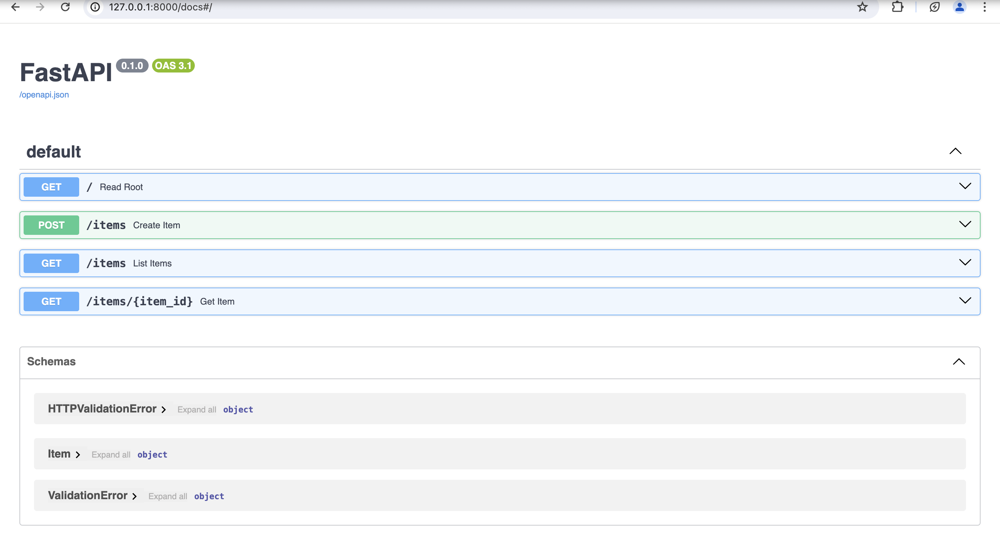

# FastAPI Application

Welcome to my FastAPI application project! This simple application demonstrates the basic functionalities of FastAPI, a modern, fast (high-performance), web framework for building APIs with Python 3.7+ based on standard Python type hints.

## Project Overview

This repository contains a basic FastAPI application that serves as a starting point for creating more complex APIs. It includes endpoints to create, read, and list items, showcasing how to use FastAPI to handle typical API operations.

### Screenshot



## Key Features

- **Root Endpoint**: A simple endpoint that returns a welcoming message.
- **Create Item**: An endpoint to create a new item and add it to the list.
- **List Items**: An endpoint to list all items with an optional limit parameter.
- **Get Item**: An endpoint to retrieve a specific item by its ID.

## Endpoints

- **GET /**: Returns a simple greeting message.
- **POST /items**: Creates a new item.
- **GET /items**: Lists all items, with an optional limit query parameter.
- **GET /items/{item_id}**: Retrieves a specific item by its ID.

## Code Overview

```python
from fastapi import FastAPI, HTTPException
from pydantic import BaseModel

app = FastAPI()

class Item(BaseModel):
    text: str
    is_done: bool = False

items = []

@app.get("/")
def read_root():
    return {"Hello": "World"}

@app.post('/items')
def create_item(item: Item):
    items.append(item)
    return items

@app.get("/items", response_model=list[Item])
def list_items(limit: int = 10):
    return items[0:limit]

@app.get('/items/{item_id}', response_model=Item)
def get_item(item_id: int) -> Item:
    if item_id < len(items):
        return items[item_id]
    else:
        raise HTTPException(status_code=404, detail=f"Item {item_id} not found")
